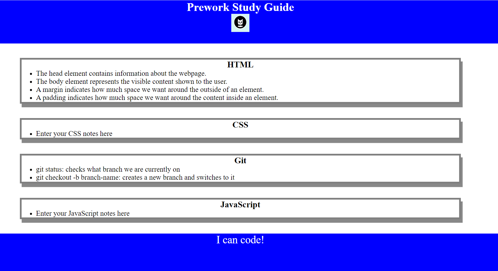

# <Prework Study Guide>

## Description

Provide a short description explaining the what, why, and how of your project. Use the following questions as a guide:

- Motivation is to switch career to Software development?
- Why did you build this project? To have a basic understanding of HTML, CSS, JS and how they integrate together
To prepare me for the course
- What did you learn? I created a simple wepage using HTML, CSS and JavaScript

## Usage

Screenshot below:

## License

The last section of a high-quality README file is the license. This lets other developers know what they can and cannot do with your project. If you need help choosing a license, refer to [https://choosealicense.com/](https://choosealicense.com/).